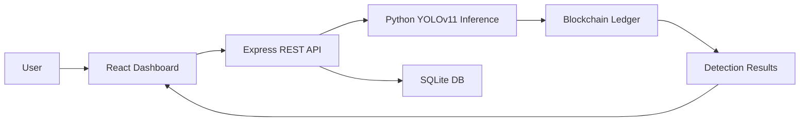

# 📦 CAM‑YOLO11
## Camouflaged Object Detection using YOLOv11 for Military Monitoring


---

### Overview
CAM‑YOLO11 is an end‑to‑end reconnaissance platform that detects camouflaged military objects in aerial or ground imagery. The system combines a React + TypeScript frontend, an Express + Node.js backend, a Python inference pipeline powered by Ultralytics YOLOv11, and a blockchain‑backed audit log. Users can upload images or video, view detection overlays, explore analytics, and securely store evidence for later review.

## ✨ Highlights
- **YOLOv11‑powered camouflaged object detection** tailored for military monitoring.
- **Real‑time inference** with visual overlays and confidence scores.
- **Secure, immutable audit trail** via a custom blockchain ledger.
- **Comprehensive analytics dashboard** showing active threats, detection trends, and system health.
- **Cross‑platform support** (Windows, macOS, Linux) with Docker‑friendly setup.
- **Modular architecture** separating UI, API, AI pipeline, and data persistence for easy extensibility.

---

## Features
- 🎯 Camouflaged object detection with YOLOv11
- 📤 Image and video analysis
- 📊 Detection history and analytics dashboard
- 🔗 Blockchain‑based evidence logging
- 🗄️ Secure SQLite storage of detections
- ⚙️ Real‑time statistics panel
- 🔒 Confidence threshold configuration

---

## System Architecture


---

## Tech Stack
| Layer      | Technology                                 |
|------------|--------------------------------------------|
| Front‑end  | React, TypeScript, Vite, Tailwind CSS      |
| Back‑end   | Node.js, Express, TypeScript               |
| AI / CV    | Python, Ultralytics YOLOv11, OpenCV        |
| Data       | SQLite                                     |
| Security   | Blockchain ledger (custom implementation) |

---

## Folder Structure
```
CAM‑YOLO11/
├─ src/                # React source code
│   ├─ components/
│   ├─ assets/
│   └─ App.tsx
├─ server/            # Express API
│   ├─ api.ts
│   └─ services/
├─ database/          # SQLite database file
│   └─ surveillance.db
├─ models/            # YOLOv11 model files
│   └─ best.pt
├─ yolo_pipeline.py   # Python inference script
├─ .env.example       # Example environment variables
└─ README.md
```

---

## Installation
### Prerequisites
- **Node.js** (v18 or later)
- **Python** (3.11 or later)
- **Git**

### Step‑by‑step
```bash
# Clone the repository
git clone https://github.com/your‑org/CAM-YOLO11.git
cd CAM‑YOLO11

# Install Node dependencies
npm install
```
#### Windows
```bash
# Create and activate a virtual environment
python -m venv venv && venv\Scripts\activate

# Install Python requirements
pip install -r requirements.txt
```
#### macOS / Linux
```bash
# Create and activate a virtual environment
python3 -m venv venv && source venv/bin/activate

# Install Python requirements
pip install -r requirements.txt
```

---

## Running the Project
```bash
# 1. Set up environment variables
cp .env.example .env
# Edit .env as needed (PORT, MODEL_PATH, DATABASE_PATH, CONFIDENCE_THRESHOLD)

# 2. Start the development server (Vite proxies API calls to Express)
npm run dev
```
The dashboard will be available at `http://localhost:5173` (Vite default).

---

## Project Workflow

*The diagram above illustrates the data flow from user interaction to final result presentation.*

---

## Model Information
The pretrained YOLOv11 model used for inference is located at:
```
models/best.pt
```
It was trained on the **MHCD2022** camouflage dataset.

---

## Dataset
The system is evaluated with the **MHCD2022** dataset, which contains labeled camouflaged objects in varied terrain and lighting conditions.

---

## Screenshots
| View            | Placeholder |
|-----------------|-------------|
| Dashboard       |  |
| Image Analysis  |  |
| Detection Result|  |
| Analytics       |  |
| Blockchain      |  |
| History         |  |

---

## Future Roadmap
- 📈 Incorporate additional camouflage datasets to improve robustness.
- 🛡️ Add role‑based access control for the dashboard.
- ⚡ Optimize inference latency with TensorRT or ONNX runtime.
- 📱 Provide a mobile‑friendly view of the analytics dashboard.
- 🧪 Implement automated end‑to‑end tests for CI pipelines.

---

## Authors
- **Ishaan Saxena** – Lead Engineer, Front‑end & UI/UX
- **[Additional contributors]** – Backend, AI pipeline, Security

---

## License
This project is licensed under the **MIT License**. See the `LICENSE` file for details.
